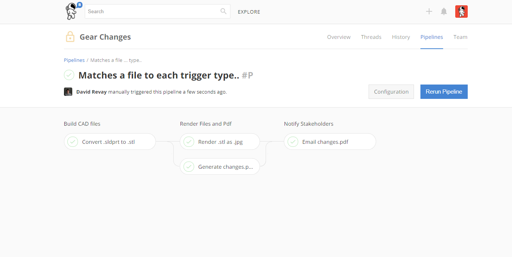

# Automation Pipelines

## What is an Automation Pipline?

An pipeline is a series of steps that run in the cloud on Stemn's cloud servers. You can configure a pipeline to do pretty much anything. For example:

* Convert a file from one format to another
* Render a CAD model and save the output images
* Run a computational fluid dynamics analysis and generate a report
* Compile and test code
* Send an email with file changes to a client or stakeholder

You can configure a pipeline to do these sorts of tasks \(and many more\) based on triggers such as particular files being modified or [committed](../untitled/commits.md).

## How they work

## Some examples

a



