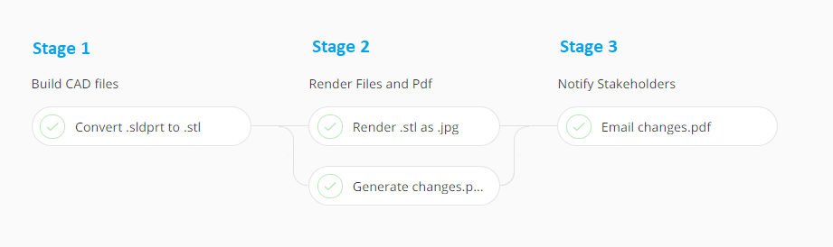

# Pipeline Stages

## How to use stages

Stages are simply a group of pipeline [steps](pipeline-steps/). All the steps in a stage execute at the same time whereas all the stages in a pipeline execute sequentially.

Take this 3 stage pipeline as an example:



Reading the stage and step labels it becomes pretty clear what is going on. By putting these steps in multiple stages we can be sure they operate in the correct order. In short, if you have a step that depends on the output of another step you'll want to move it into another stage.

## How to define stages

Stages will execute in the order you define in your `.pipeline` file. All they contain a list of `steps` and `label`. Simple right? Defining the [steps ](pipeline-steps/)is where things start to get a little complicated.

```yaml
...
stages:
- label: Build CAD files
  steps:
  - ...
- label: Render Files and Pdf
  steps:
  - ...
  - ...
- label: Notify Stakeholders
  steps:
  - ...
...
```

More specifically, the supported options are:

| **Key** | **Description** |
| --- | --- | --- |
| label | A string describing the stage |
| steps | An array of [steps](pipeline-steps/) |


The full schema with all possibilities is available at [schemas.stemn.com/pipline/stages+v1](http://schemas.stemn.com/pipeline/stages+v1)


