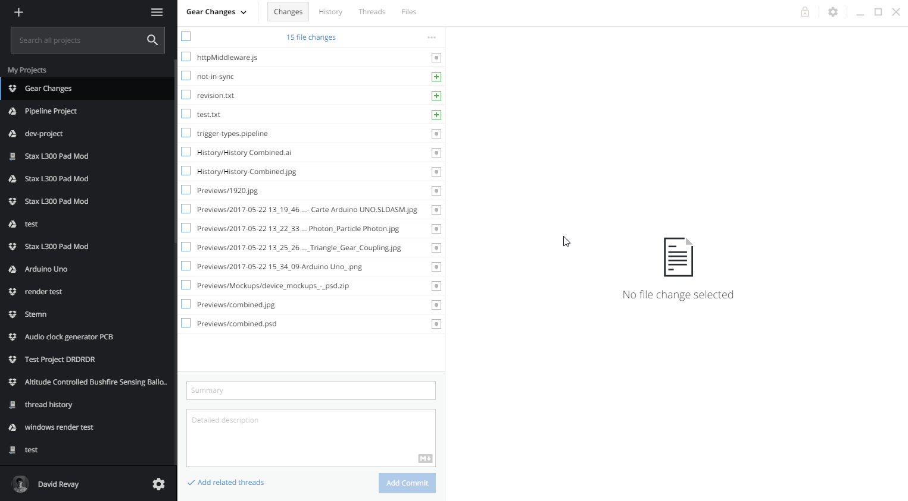

# Commits

## What is a Commit?

A commit is best thought of as a **group of file **[**revisions**](revisions.md) along with a **summary **and **description **describing what changes you have made and how. Importantly, when you create a commit, you can also **link related or completed threads**. This allows you and your team members to see which files changed in order to implement a task \(and also compare the file before and after the changes\).


Commits are one of the most critical parts of effective teamwork using stemn. A thoughtful commit **summary** and **description** will help your entire team keep track of progress.


## How are they created?

To create a commit, you must have [stemn desktop](../stemn-desktop.md) installed and configured. You'll also need Dropbox or Google drive installed so your file revisions sync correctly. After that, you have 2 different methods. These instructions vary slightly with operating system.

### From the taskbar:

### From the 'changes' tab of the desktop app:

