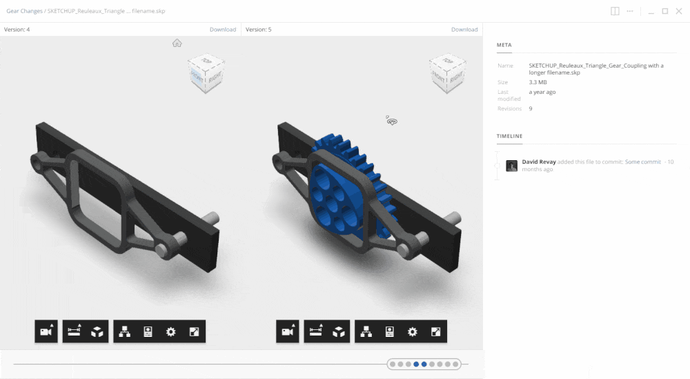

# Preview & Compare

## Previews

Both the [stemn.com](https://stemn.com) website and [stemn desktop]() app support a variety of different file previews. Most importantly, you can preview and explore pretty much any type of CAD model. This is particularly useful if you need to share a preview of your files with a team member or client that doesn't necessarily have the correct software installed.

## Compare

Along with previewing a file, you can compare different file [revisions ](revisions.md)to see how they have changed. The supported compare modes vary with the file type you are previewing.

