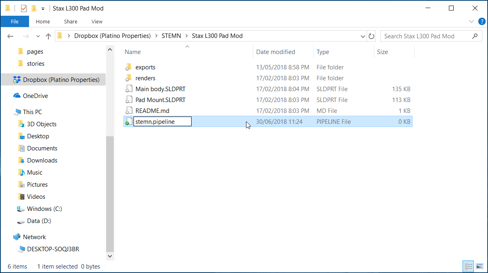
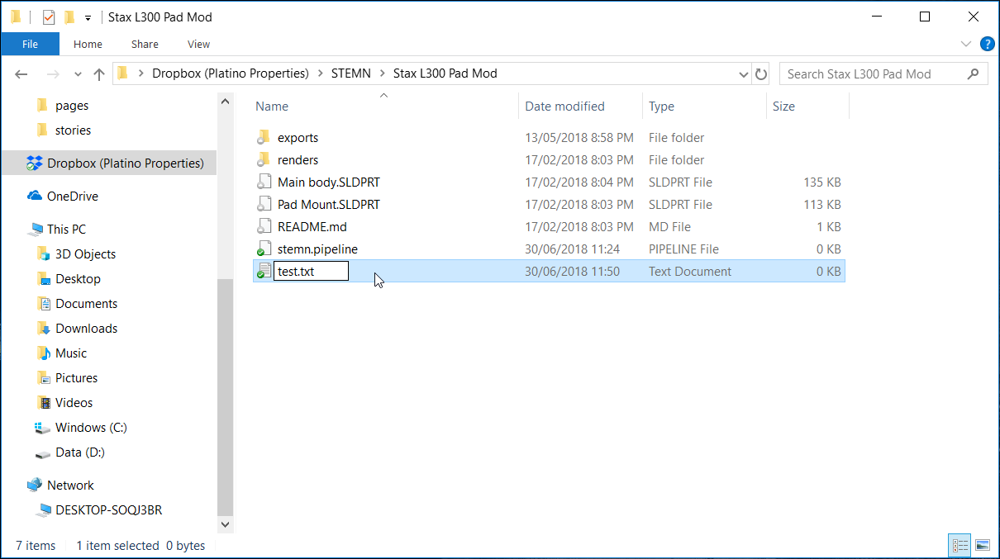
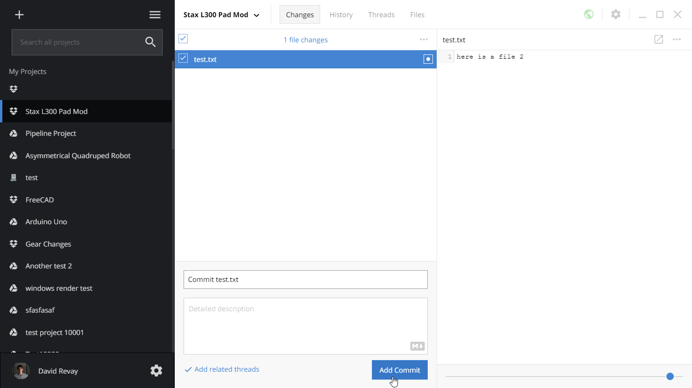

# Create a Pipeline

Pipelines allow you to automate a variety of common computer based tasks. All of the configuration for your Automation Pipeline is contained within a `*.pipeline` file which is stored along side your other project files.

## Create your first pipeline

* Add a file called `stemn.pipeline` to the root of your project folder

  

* Open your new `stemn.pipeline` file in a text editor such as Notepad, TextEdit or a code editor like vscode.
* Paste the following pipeline configuration: 



```yaml
$schema: https://schemas.stemn.com/pipeline+v1

label: Matches a file to each trigger type...

triggers:
- files: test.txt
  type: commit

stages:
- label: Notifications
  steps:
  - label: Send email
    image: stemn/email
    config: 
      to: enteryouremail@here.com // Put your email here
      subject: New commit to file called 'test.txt'
      message: This is the email body
      
```




Replace `enteryouremail@here.com` above with your email.


* This pipeline will run whenever you commit a file called `test.txt` in the root of your folder. It will then send an email to your email notifying you of this change. This type of configuration is useful to notify your teammates or stakeholders of critical file changes.

## Test your first pipeline

* Create a new file called `test.txt` in the root of your project.

  

* Commit the `test.txt` file using stemn desktop ui.

  

* Navigate to your project on the stemn website and open the **Pipelines** tab.
* You should see the log output of your pipeline. If configured correctly, you should have received a notification email.

## Learn more about pipelines




