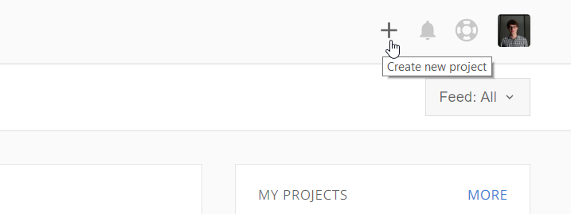
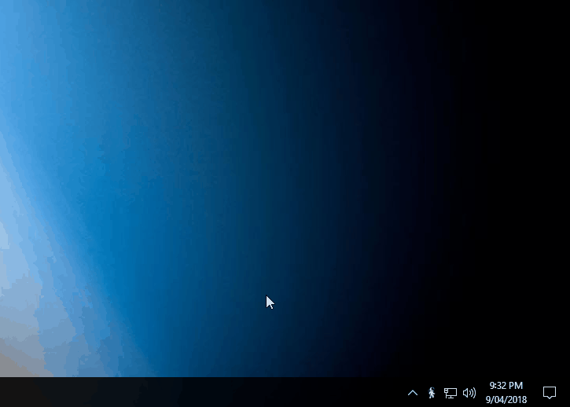

# Initial Setup

This guide will help you setup your first project and get it syncing to stemn. It assumes you already have a project on Google Drive or Dropbox.

### Create your first project

* **Join or login** to Stemn. Follow the initial account creation wizard if you are making a new account.
* From your [dashboard](https://stemn.com), click on the '+' icon in the top right to **create a new project**.

* Follow the steps and setup your project **name**, **summary** and set the **visibility** to either public or private.
* Next you'll need to configure your cloud provider. Select **Dropbox** or **Drive** and navigate to your project folder.
* Now that you've selected your project folder, hit **Create**
* Your project folder will now be linked to Stemn. Any changes you make through Dropbox or Drive will be synced to our servers giving you access to infinite [revision ](../files-and-syncing/revisions.md)history and in-browser file [previews](../files-and-syncing/preview-and-compare/).

### Create your first commit

Now that you have a stemn project, you can add commit messages to document what changes you have made to your files.

* Download and install [Stemn Desktop](../stemn-desktop.md) - you'll need to login to your account after it has installed.
* Make sure you have either the Dropbox or Drive client installed
* Create your first commit:

### From the taskbar:

### From the 'changes' tab of the desktop app:

