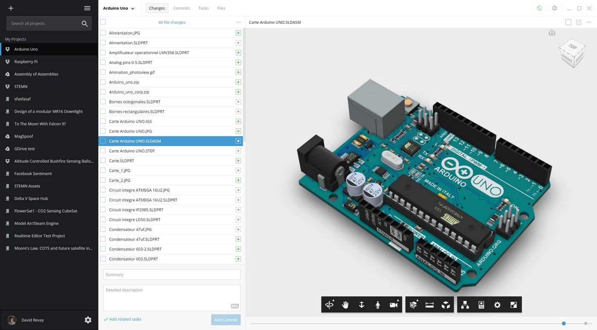

# Stemn Desktop

Stemn Desktop is available for Windows, Mac and Linux. You can download it [here](https://stemn.com/download). 

Once you have Stemn Desktop installed you'll be able to create [commits ](files-and-syncing/commits.md)and browse your file history without opening up the website.

