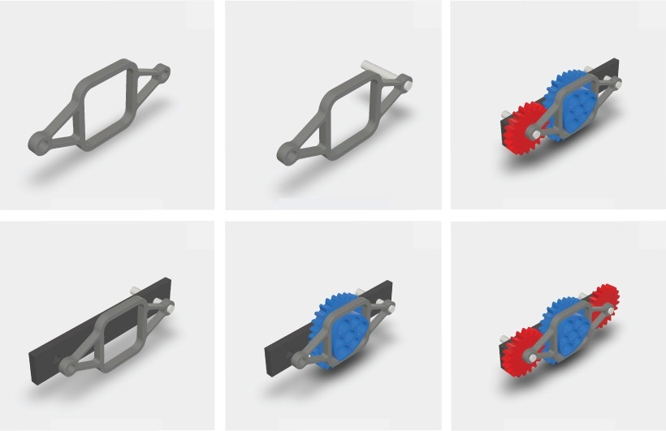

# Revisions

## What is a Revision?

A revision is simply a **previous version of a file**. Every time a file sync to Stemn through your Dropbox or Google drive, we save a version if it on our secure servers. This means you'll have a full history of every change you and your team have made to your project files.

## How to access revisions

You can access the file revisions from both the [stemn.com](http://stemn.com) website and [stemn desktop](../stemn-desktop.md).

1. Login to your account
2. Navigate to your project
3. Open a file \(this assumes your stemn project is connected to Dropbox/Drive\)
4. You'll see a list of all your file revisions in the timeline. Click on these to preview or download a previous version of your file.

## Packing revisions with Commits

The sheer number of revisions can get pretty overwhelming. You can easily end up with hundreds or even thousands of old file revisions, at which point it is pretty hard to tell exactly what changes have occurred. This is where commits come in. Commits allow you to group a series of sequential revisions and leave a note describing which changes you implemented and how. Learn more:



